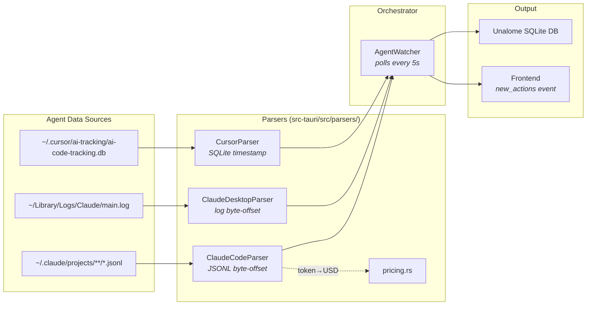

# Agent Parsers — Overview

Unalome intercepts AI agent activity by reading each agent's local data files. There is no network interception or process injection — all parsing is read-only against files on disk.

## Architecture

```
src-tauri/src/parsers/
  mod.rs              — AgentParser trait + AgentWatcher orchestrator
  claude_code.rs      — JSONL transcript parser
  claude_desktop.rs   — Plain-text log parser
  cursor.rs           — SQLite database parser
  pricing.rs          — Token-to-USD cost estimation
```



### AgentParser trait

Every parser implements this trait:

```rust
pub trait AgentParser: Send + Sync {
    fn agent_id(&self) -> &str;
    fn parse_new_actions(&mut self) -> Result<Vec<Action>>;
}
```

Each parser tracks its own read position (byte offset for files, timestamp for databases) so that `parse_new_actions()` only returns data that appeared since the last poll.

### AgentWatcher orchestrator

`AgentWatcher` holds a `Vec<Box<dyn AgentParser>>`. On startup, the app discovers which agents are installed (via `discovery.rs`), then creates one parser per agent.

The main polling loop runs every 5 seconds:

1. `AgentWatcher::poll()` calls `parse_new_actions()` on each parser
2. Results are merged and sorted by timestamp
3. New actions are saved to the local SQLite database
4. A `"new_actions"` event is emitted to the frontend

### Deduplication strategy

Each parser avoids re-reading data:

| Parser | Tracking mechanism |
|---|---|
| Claude Code | `HashMap<PathBuf, u64>` — byte offset per JSONL file |
| Claude Desktop | `u64` — byte offset in `main.log` |
| Cursor | `i64` — max `timestamp` value per SQL table |

### Action model

Every parsed event becomes an `Action`:

```rust
pub struct Action {
    pub id: String,            // Prefixed UUID (cc-, cd-, cur-)
    pub agent_id: String,      // "claude-code", "claude-desktop", "cursor"
    pub action_type: ActionType,
    pub timestamp: DateTime<Utc>,
    pub description: String,   // Human-readable summary
    pub risk_level: RiskLevel, // Safe, Low, Medium, High, Critical
    pub cost: Option<CostInfo>,
    pub metadata: serde_json::Value,
}
```

See the individual agent docs for details on what each parser extracts.
