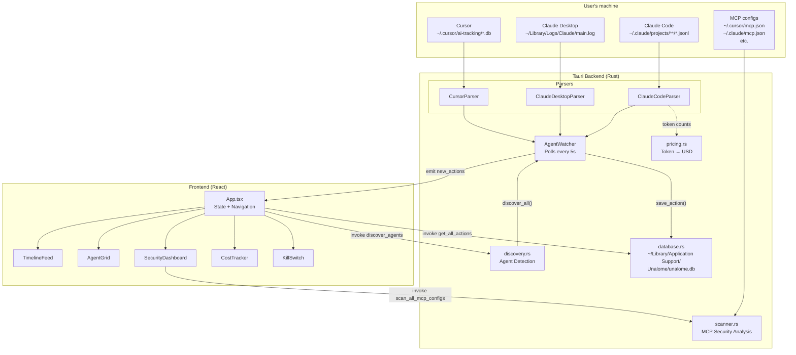
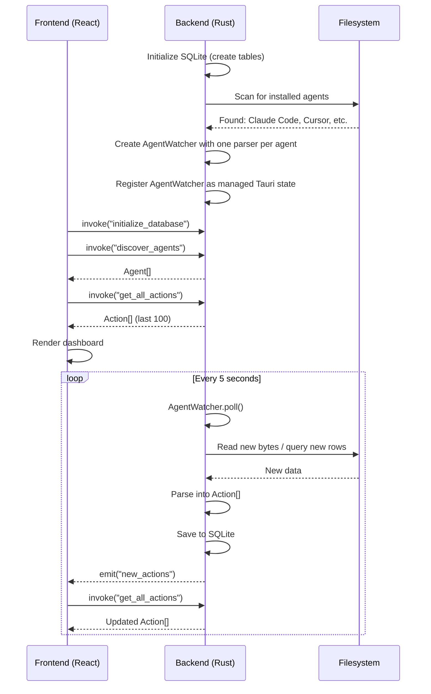
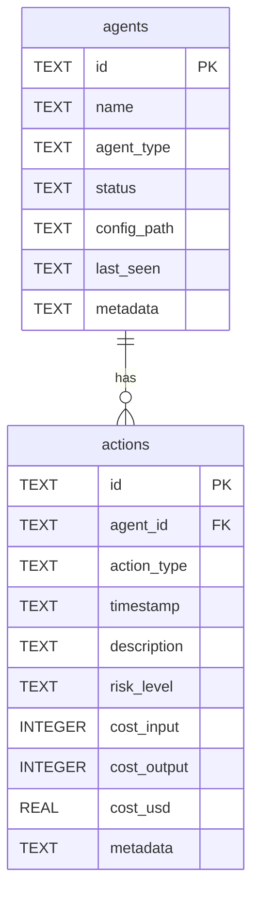
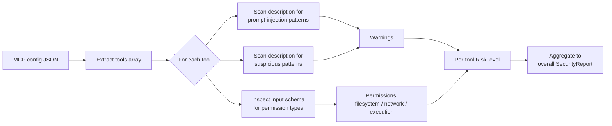

# Unalome — Architecture

Unalome is a local-first desktop application — a "Personal Agent Firewall & Observatory." It monitors AI coding agents installed on the user's machine, showing their activity timeline, security posture of MCP servers, token costs, and a control panel.

## Tech stack

| Layer | Technology |
|---|---|
| Desktop shell | Tauri 2 (Rust) |
| Frontend | React 18 + TypeScript |
| Styling | Tailwind CSS + Radix UI primitives + CVA |
| Charts | Recharts |
| Backend DB | SQLite via sqlx (app's own data) |
| Agent DB reading | rusqlite (read-only, for Cursor's SQLite) |
| Async runtime | Tokio |
| Build | Vite (frontend) + Cargo (backend) |

## High-level data flow



## Startup sequence



## Module map

### Backend (`src-tauri/src/`)

| File | Responsibility |
|---|---|
| `main.rs` | Tauri entry point, all `#[tauri::command]` handlers, background polling loop |
| `lib.rs` | Module re-exports |
| `models.rs` | All shared types: Agent, Action, ActionType, RiskLevel, CostInfo, SecurityReport |
| `database.rs` | SQLite persistence — `agents` and `actions` tables |
| `discovery.rs` | Filesystem scanning to detect installed agents and MCP configs |
| `scanner.rs` | Static analysis of MCP server configs for security risks |
| `watcher.rs` | Legacy `FileWatcher` (notify-based, kept for future use) |
| `parsers/mod.rs` | `AgentParser` trait + `AgentWatcher` orchestrator |
| `parsers/claude_code.rs` | JSONL transcript parser |
| `parsers/claude_desktop.rs` | Plain-text log parser |
| `parsers/cursor.rs` | SQLite database reader (read-only) |
| `parsers/pricing.rs` | Token-to-USD cost estimation |

### Frontend (`src/`)

| File | Responsibility |
|---|---|
| `main.tsx` | React root, mounts `<App>` |
| `App.tsx` | Root component — holds all state, sidebar nav, view switching, Tauri invoke/listen |
| `types/index.ts` | TypeScript types mirroring Rust models |
| `lib/utils.ts` | `cn()` for class merging, `formatDate()`, `formatCurrency()`, `formatNumber()` |
| `components/AgentGrid.tsx` | Grid of agent cards with status indicators |
| `components/TimelineFeed.tsx` | Filterable, searchable action timeline |
| `components/SecurityDashboard.tsx` | MCP security scan results, risk score, per-tool breakdown |
| `components/CostTracker.tsx` | Token cost charts by period, budget tracking |
| `components/KillSwitch.tsx` | Pause/resume agent controls (UI-only currently) |
| `components/OnboardingFlow.tsx` | 4-step first-run wizard |
| `components/CircularProgress.tsx` | Reusable SVG progress ring |
| `components/ui/*` | Radix + CVA primitive components (Button, Card, Badge, etc.) |

## Frontend architecture

### Navigation

No router library. A single `activeView` state variable in `App.tsx` switches between views:

| View | Component | Sidebar icon |
|---|---|---|
| `"overview"` | `AgentGrid` | Activity |
| `"timeline"` | `TimelineFeed` | Clock |
| `"security"` | `SecurityDashboard` | Shield |
| `"costs"` | `CostTracker` | DollarSign |
| `"control"` | `KillSwitch` | Power |

### State management

No global store. All state lives in `App.tsx` and flows down via props:

```
App.tsx
  ├── agents: Agent[]
  ├── actions: Action[]
  ├── loading: boolean
  ├── activeView: string
  └── showOnboarding: boolean
```

### Tauri IPC bridge

Frontend ↔ Backend communication uses two mechanisms:

1. **Commands** (`invoke()`): Request-response calls from frontend to backend
2. **Events** (`listen()`): Push notifications from backend to frontend

| Command | Direction | Purpose |
|---|---|---|
| `initialize_database` | FE → BE | Create SQLite tables |
| `discover_agents` | FE → BE | Scan for installed agents |
| `get_all_actions` | FE → BE | Load last 100 actions |
| `get_agent_actions` | FE → BE | Load actions for one agent |
| `scan_all_mcp_configs` | FE → BE | Run security scans |
| `scan_mcp_server` | FE → BE | Scan single MCP server |
| `poll_new_actions` | FE → BE | Manual poll trigger |
| `new_actions` (event) | BE → FE | Notifies frontend of new data |

### Styling

- Tailwind CSS with HSL design tokens for theming
- Per-view gradient backgrounds (`.app-bg-overview`, `.app-bg-security`, etc.)
- Glass morphism cards (`.glass-card` — frosted glass with backdrop blur)
- 72px icon sidebar with active-item glow
- Custom risk-level badges (`.status-safe` through `.status-critical`)
- Radix UI primitives + `class-variance-authority` for component variants

### Onboarding

First-run detection via `localStorage.getItem("unalome_onboarding_complete")`. The `OnboardingFlow` component walks through 4 steps before showing the main dashboard.

## Database schema

Stored at `~/Library/Application Support/Unalome/unalome.db` (macOS).



## Security scanning

The `SecurityScanner` analyzes MCP server configs using regex pattern matching:



**Pattern categories:**
- Prompt injection: "ignore previous instructions", "system prompt", "you are now"
- Suspicious: passwords/tokens/secrets, exfiltration keywords, exec/eval/shell
- Permission inference: file/path → filesystem, url/endpoint → network, command/exec → execution

## Known limitations

1. **action_type DB roundtrip is lossy** — `ActionType` is stored as Rust `Debug` format, loaded back as `ActionType::Other(string)`. Structured type info is lost on reload.
2. **KillSwitch is UI-only** — pause/resume updates React state but doesn't actually stop any agent process.
3. **Budget limit is hardcoded** at $50 in `CostTracker.tsx`.
4. **No URL routing** — browser back/forward don't work, no deep linking.
5. **Windsurf and OpenClaw** are discovered but have no parser implementation yet.
