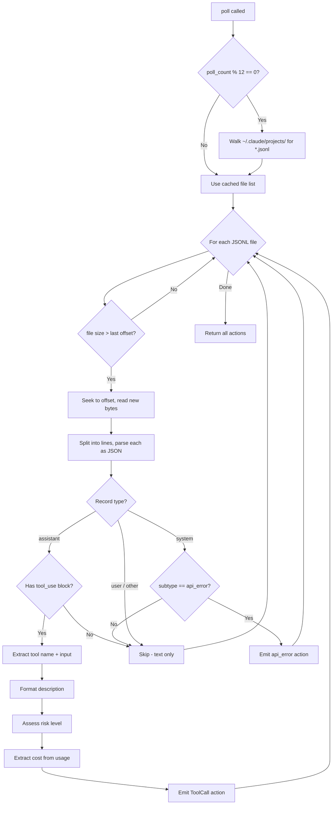

# Claude Code Parser

**Source file:** `src-tauri/src/parsers/claude_code.rs`
**Agent ID:** `claude-code`

## Data source

Claude Code stores conversation transcripts as JSONL files at:

```
~/.claude/projects/<escaped-project-path>/<session-uuid>.jsonl
```

Each line is a self-contained JSON object. The parser walks `~/.claude/projects/` with max depth 4 to find all `*.jsonl` files.

### File discovery

New JSONL files are discovered every 12 polls (~60 seconds at the 5-second interval). This handles new sessions starting while the app is running.

### Incremental reading

A `HashMap<PathBuf, u64>` tracks the byte offset per file. On each poll, the parser:

1. Checks file size via `fs::metadata`
2. If size > last offset, seeks to the offset and reads only new bytes
3. Splits by newlines, parses each as JSON
4. Updates the stored offset

## Record types parsed

Each JSONL line has a `"type"` field. The parser handles:

### `"assistant"` records

These contain the model's response. The parser looks at `message.content[]` for blocks with `type: "tool_use"`.

**Extracted fields:**

| JSON path | Maps to |
|---|---|
| `message.content[].name` | `ActionType::ToolCall { tool_name }` |
| `message.content[].input` | `ActionType::ToolCall { args }` |
| `message.usage.input_tokens` | `CostInfo.tokens_input` (partial) |
| `message.usage.output_tokens` | `CostInfo.tokens_output` |
| `message.usage.cache_creation_input_tokens` | Used for cost calculation |
| `message.usage.cache_read_input_tokens` | Used for cost calculation |
| `message.model` | Stored in metadata, used for pricing lookup |

**If no `tool_use` block is found** (pure text response), the record is skipped — only tool calls are tracked as actions.

### `"system"` records

Only the `"api_error"` subtype is parsed:

| JSON path | Maps to |
|---|---|
| `error.error.type` | Description: `"API error: {type} (status {code})"` |
| `error.status` | Included in description |

Risk level: `Low`.

### `"user"` records

Skipped entirely. These contain tool results (stdout, file contents, diffs) which are follow-ups to the assistant's tool calls, not separate actions.

## Description formatting

The parser generates human-readable descriptions from each tool's input:

| Tool | Description format | Input field used |
|---|---|---|
| `Bash` | `Bash: ls -la /src/` | `input.command` (truncated to 80 chars) |
| `Read` | `Read: /src/main.rs` | `input.file_path` |
| `Edit` | `Edit: /src/main.rs` | `input.file_path` |
| `Write` | `Write: /src/main.rs` | `input.file_path` |
| `Grep` | `Grep: TODO` | `input.pattern` |
| `Glob` | `Glob: **/*.rs` | `input.pattern` |
| `Task` | `Task: subagent` | `input.description` |
| Other | Tool name as-is | — |

## Risk assessment

Risk is assessed per tool call based on the tool name and, for Bash, the command content:

| Tool | Risk | Condition |
|---|---|---|
| `Bash` | **High** | Command contains `rm `, `sudo `, `curl`+`\| sh`, `chmod`, `mkfs` |
| `Bash` | **Medium** | All other commands |
| `Write` | **Medium** | Always |
| `Edit` | **Medium** | Always |
| `Read` | **Safe** | Always |
| `Glob` | **Safe** | Always |
| `Grep` | **Safe** | Always |
| `Task` | **Low** | Always (subagent spawn) |
| Other | **Low** | Default |

## Cost estimation

Claude Code logs do not include dollar amounts. Cost is computed from token counts using `parsers::pricing`:

```
cost = (input_tokens * input_rate
      + cache_write_tokens * cache_write_rate
      + cache_read_tokens * cache_read_rate
      + output_tokens * output_rate) / 1,000,000
```

Model detection is by substring match on `message.model`:

| Model contains | Input | Cache write | Cache read | Output |
|---|---|---|---|---|
| `opus` | $15.00/M | $18.75/M | $1.50/M | $75.00/M |
| `sonnet` | $3.00/M | $3.75/M | $0.30/M | $15.00/M |
| `haiku` | $0.80/M | $1.00/M | $0.08/M | $4.00/M |
| default | $3.00/M | $3.75/M | $0.30/M | $15.00/M |

The `CostInfo.tokens_input` field stores the sum of `input_tokens + cache_creation_input_tokens + cache_read_input_tokens`.

## Timestamp extraction

The parser tries multiple formats from the `"timestamp"` field:

1. RFC 3339 string (e.g., `"2026-03-18T14:30:00Z"`)
2. Unsigned integer (epoch milliseconds)
3. Signed integer (epoch milliseconds)
4. Falls back to `Utc::now()` if none match

## Metadata

Each action includes metadata:

```json
{
  "model": "claude-sonnet-4-6-20260318",
  "session_file": "/Users/.../.claude/projects/.../abc123.jsonl"
}
```

## ID format

Action IDs are prefixed: `cc-<uuid-v4>`.

## Flow diagram


