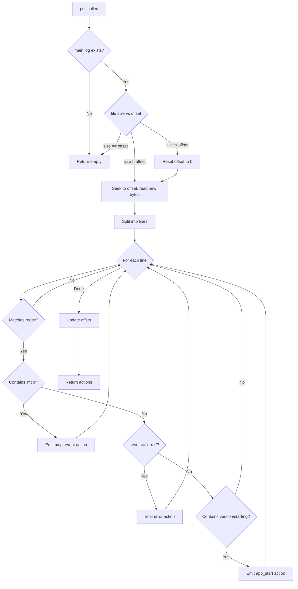

# Claude Desktop Parser

**Source file:** `src-tauri/src/parsers/claude_desktop.rs`
**Agent ID:** `claude-desktop`

## Data source

Claude Desktop writes plain-text logs to:

```
~/Library/Logs/Claude/main.log
```

This is a standard macOS log location. The file grows slowly (under 1MB typically) and contains structured log lines — not JSON.

## Log format

Each line follows this pattern:

```
YYYY-MM-DD HH:MM:SS [level] [tag] message...
```

The parser uses a regex to extract three capture groups:

```
^(\d{4}-\d{2}-\d{2} \d{2}:\d{2}:\d{2})\s+\[(\w+)\]\s+(.*)$
```

| Group | Content | Example |
|---|---|---|
| 1 | Timestamp | `2026-03-18 14:30:00` |
| 2 | Log level | `info`, `error`, `warn` |
| 3 | Message body | `[SkillsPlugin] MCP server started...` |

Lines that don't match the regex are silently skipped.

## Events extracted

The parser filters for three categories of events:

### MCP events

**Condition:** Message body contains `"mcp"` (case-insensitive).

These capture MCP server lifecycle events — starts, stops, connection errors, tool registrations.

| Field | Value |
|---|---|
| `action_type` | `Other("mcp_event")` |
| `risk_level` | **Safe** |
| `description` | `MCP: {message}` (truncated to 120 chars) |
| `metadata.level` | Log level from the line |
| `metadata.raw` | Full message body |

### Errors

**Condition:** Log level is `"error"`.

| Field | Value |
|---|---|
| `action_type` | `Other("error")` |
| `risk_level` | **Medium** |
| `description` | `Error: {message}` (truncated to 120 chars) |
| `metadata.level` | `"error"` |
| `metadata.raw` | Full message body |

### App start events

**Condition:** Message contains `"version"`, `"starting"`, or `"Started"`.

| Field | Value |
|---|---|
| `action_type` | `Other("app_start")` |
| `risk_level` | **Safe** |
| `description` | Message body (truncated to 120 chars) |
| `metadata.level` | Log level from the line |

### All other lines

Skipped — most log lines are routine debug/info output that isn't actionable.

## Incremental reading

A single `u64` byte offset tracks the read position in `main.log`.

On each poll:

1. Check file size via `fs::metadata`
2. If size > offset, seek to offset and read new bytes
3. If size < offset, the log was rotated — reset offset to 0 and read from the start
4. Parse each new line, update offset

## Log rotation handling

If the file size is smaller than the stored offset, the parser assumes log rotation occurred and resets to position 0. This prevents missing events after Claude Desktop restarts and rotates its logs.

## Cost estimation

Not applicable — Claude Desktop logs do not contain token usage or API call details. All actions have `cost: None`.

## Timestamp handling

Timestamps are parsed with `NaiveDateTime::parse_from_str` using format `%Y-%m-%d %H:%M:%S`. The result is treated as UTC. Falls back to `Utc::now()` if parsing fails.

## ID format

Action IDs are prefixed: `cd-<uuid-v4>`.

## Flow diagram


