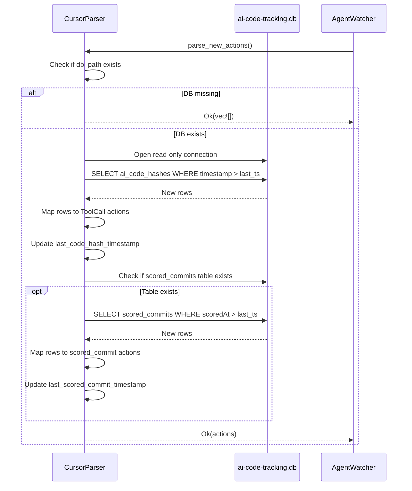

# Cursor Parser

**Source file:** `src-tauri/src/parsers/cursor.rs`
**Agent ID:** `cursor`

## Data source

Cursor stores AI tracking data in a SQLite database at:

```
~/.cursor/ai-tracking/ai-code-tracking.db
```

The parser opens this file **read-only** using `rusqlite` with `SQLITE_OPEN_READ_ONLY | SQLITE_OPEN_NO_MUTEX` flags. This avoids interfering with Cursor's own writes.

If the database file does not exist, the parser silently returns no actions.

## Tables read

### `ai_code_hashes`

Stores every AI-generated code completion and composer edit.

**Query:**

```sql
SELECT hash, source, fileExtension, fileName, model, timestamp, requestId, conversationId
FROM ai_code_hashes
WHERE timestamp > ?1
ORDER BY timestamp ASC
```

The `?1` parameter is the last-seen timestamp (epoch milliseconds). On the first poll it is `0`, capturing all historical data.

**Mapping to actions:**

| `source` value | `ActionType` | `RiskLevel` | Description format |
|---|---|---|---|
| `"tab"` | `ToolCall { tool_name: "tab_completion" }` | **Safe** | `Tab completion: {fileName}` |
| `"composer"` | `ToolCall { tool_name: "composer_edit" }` | **Low** | `Composer edit: {fileName}` |
| other | `ToolCall { tool_name: "{source}" }` | **Low** | `{source}: {fileName}` |

**Tool call args include:**

```json
{
  "file_name": "main.rs",
  "file_extension": ".rs",
  "model": "claude-3.5-sonnet",
  "request_id": "req_abc123",
  "conversation_id": "conv_xyz"
}
```

**Metadata includes:**

```json
{
  "hash": "abc123...",
  "source": "tab",
  "model": "claude-3.5-sonnet"
}
```

### `scored_commits`

Stores commit-level statistics about AI vs. human-written code. The parser first checks whether this table exists (it may not be present in all Cursor versions).

**Query:**

```sql
SELECT commitHash, commitMessage, commitDate, tabLinesAdded, composerLinesAdded, humanLinesAdded, scoredAt
FROM scored_commits
WHERE scoredAt > ?1
ORDER BY scoredAt ASC
```

**Mapping to actions:**

| Field | Maps to |
|---|---|
| `commitMessage` | Description: `Commit: {message} ({X}% AI)` (truncated to 60 chars) |
| `tabLinesAdded + composerLinesAdded` | AI lines |
| `humanLinesAdded` | Human lines |
| AI % = `ai_lines / total_lines * 100` | Stored in metadata |

All scored commits are mapped to `ActionType::Other("scored_commit")` with `RiskLevel::Safe`.

**Metadata includes:**

```json
{
  "commit_hash": "abc123",
  "tab_lines": 42,
  "composer_lines": 18,
  "human_lines": 100,
  "ai_percentage": 37.0
}
```

## Deduplication

Each table tracks its own `last_*_timestamp` (epoch milliseconds). The `WHERE timestamp > ?1` clause ensures only new rows are returned on each poll.

The max timestamp from each result set is saved for the next poll.

## Cost estimation

Not currently implemented — Cursor's database does not include token counts. All actions have `cost: None`.

## Timestamp handling

Timestamps in the database are epoch milliseconds. They are converted to `DateTime<Utc>` via `DateTime::from_timestamp_millis()`. Falls back to `Utc::now()` on conversion failure.

## ID format

Action IDs are prefixed: `cur-<uuid-v4>`.

## Flow diagram


